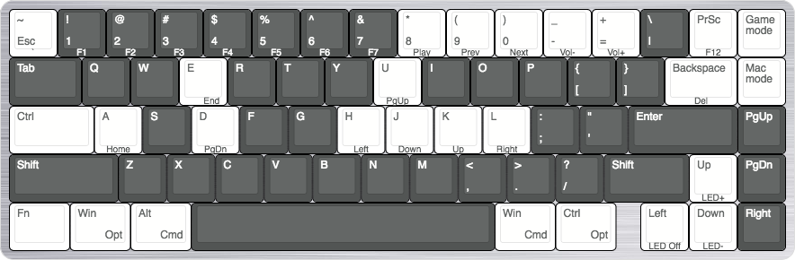

# Keyboard Layouts

I change my keyboard layouts pretty frequently so it helps to have a visual reminder of what my bindings are. I used [Keyboard Layout Editor](https://keyboard-layout-editor.com) to build these mockups. Any config available is in keyboard's respective folders.

## POK3R

The daily driver, primarily used for work as I can map keybinds on the flow if I need to quickly.

Switches | Caps | Case
---------|------|-----
Cherry MX Clear | Thick PBT Blanks (Dark Grey) | Stock Aluminium (Black)

### Known Issues

N/A

## Whitefox

Primarily used at home for gaming or light development. Requires firmware built by [The IC Configurator](https://input.club/configurator-whitefox/) or from scratch.

Switches | Caps | Case
---------|------|-----
Cherry MX Clear | Whitefox Stock (White) | Stock Aluminium (Silver)

### Known Issues

I currently don't have a `~` key. I'm yet to compile my own firmware for this keyboard but as it mostly sits at home and is used for gaming this a lower priority for now. Possible fix [here](https://input.club/forums/topic/how-to-mapping-shift-esc-to/).
