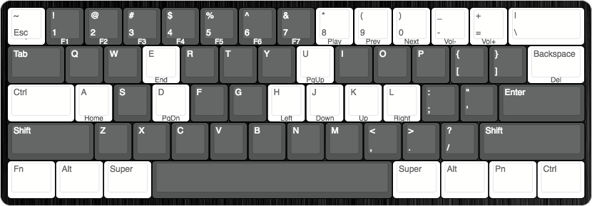

# Keyboard Layouts

I change my keyboard layouts pretty frequently so it helps to have a visual reminder of what my bindings are. I used [Keyboard Layout Editor](https://keyboard-layout-editor.com) to build these mockups. Any config available is in keyboard's respective folders.

## POK3R

The daily driver, primarily used for work as I can map keybinds on the flow if I need to quickly.

Switches | Caps | Case
---------|------|-----
Cherry MX Clear | Thick PBT Blanks (Dark Grey) | Stock Aluminium (Black)



### Known Issues

N/A

## Whitefox

Now using QMK firmware. Ensure `dfu-util` is available on `$PATH`

TODO: Layout images/ASCII

1. `git clone git@github.com:qmk/qmk_firmware.git` to somewhere
2. `make git-submodule` from within the qmk_firmware directory
3. Copy `keymap.c` from dotfiles repo into `/path/to/qmk_firmware/keyboards/whitefox/keymaps/xs1mple/keymap.c`
4. From the from within the qmk_firmware repo, run:  
    ```docker run -e keymap=xs1mple -e keyboard=whitefox --rm -v $('pwd'):/qmk:rw edasque/qmk_firmware```
5. Enter flashing mode on Whitefox Keyboard
6. Run `sudo dfu-util -D .build/whitefox_xs1mple.bin`
