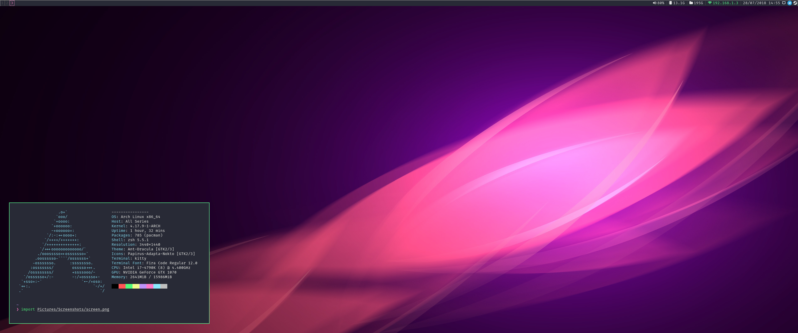

# dotfiles



## os

Download and install Arch Linux from the [official mirrors](https://www.archlinux.org/download/). Follow various installation guides on the Wiki/saved gists.

Download and install the latest version of macOS from the Mac App Store.

## setup

> Note: All installation instructions assume Arch Linux unless specified.

Arch Linux installs currently requires a little bit of research to get up and running. See the [Packagelist](./Packagelist) for which packages I've installed previously.

See [this gist](https://gist.github.com/njam/85ab2771b40ccc7ddcef878eb82a0fe9) for the laptop install guide.

> Todo: Arch Linux desktop install guide

See the [Brewfile](./Brewfile) and [CaskFile](./Caskfile) for installed macOS applications.

Install Aura:

```bash
mkdir aura-bin && wget -O PKGBUILD https://aur.archlinux.org/cgit/aur.git/plain/PKGBUILD?h=aura-bin

cd aura-bin
makepkg --install
```

Install homebrew (macOS):

```bash
ruby -e "$(curl -fsSL https://raw.github.com/Homebrew/homebrew/go/install)" > /tmp/homebrew-install.log`

brew bundle
```

> Todo: Complete package list for homebrew

Grab dotfiles:

```bash
git clone https://gitlab.com/JackCuthbert/dotfiles.git ~/.dotfiles
```

Install zplug and fresh:

```bash
# zplug
curl -sL --proto-redir -all,https https://raw.githubusercontent.com/zplug/installer/master/installer.zsh | zsh

# fresh
bash -c "`curl -sL https://get.freshshell.com`"

# remove the auto-generated freshrc and link new one
rm ~/.freshrc
ln -s "~/.dotfiles/freshrc.sh" "~/.freshrc"
```

Install version managers for tools:

```bash
# NVM
curl -o- https://raw.githubusercontent.com/creationix/nvm/v0.33.2/install.sh | bash`

# TPM
git clone https://github.com/tmux-plugins/tpm ~/.tmux/plugins/tpm

# VimPlug
curl -fLo ~/.local/share/nvim/site/autoload/plug.vim --create-dirs \
    https://raw.githubusercontent.com/junegunn/vim-plug/master/plug.vim
```

Install OpenVPN + PIA:

```bash
# Download install script
wget -O pia-nm.sh http://www.privateinternetaccess.com/installer/pia-nm.sh

# CHECK CONTENTS!

# Mark script as executable and run it
chmod +x pia-nm.sh
sudo ./pia-nm.sh

# Select UDP and strong encryption

# Restart NetworkManager
sudo systemctl restart NetworkManager.service
```
